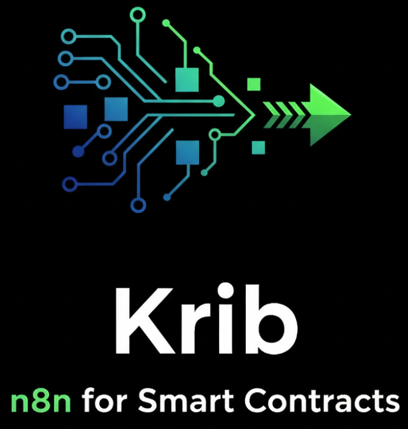

# Krib

<div align="center">
  
  
  <h3>Drag & Drop Smart Contract Builder</h3>
  
  <p>
    <strong>Build, visualize and deploy smart contracts with ease</strong>
  </p>
  
  <p>
    <a href="https://github.com/hr-shiit/krib/stargazers">
      
    </a>
    <a href="https://github.com/hr-shiit/krib/network/members">
      
    </a>
    <a href="https://github.com/hr-shiit/krib/issues">
      
    </a>
    <a href="https://github.com/hr-shiit/krib/blob/main/LICENSE">
      
    </a>
  </p>
</div>

## ✨ Overview

Krib is a powerful visual interface for creating, testing, and deploying smart contracts with zero coding required. Built with an intuitive n8n-inspired workflow design, Krib empowers developers to build complex contract interactions through a simple drag-and-drop interface.

<div align="center">
  
</div>

## 🚀 Features

- **Visual Contract Builder** - Drag and drop components to build your contract workflow
- **Pre-built Components** - Library of contract templates, functions, and common patterns
- **Live Contract Preview** - See Solidity code generated in real-time
- **Testing Sandbox** - Test your contract in a simulated environment before deployment
- **Multi-Chain Deployment** - Deploy to Ethereum, Polygon, BSC and other EVM chains
- **Contract Verification** - Automatically verify your contract on blockchain explorers
- **Export Options** - Export your contract as Solidity, Vyper, or ready-to-deploy bytecode

## 🛠️ Getting Started

### Prerequisites

- Node.js (v16+)
- Yarn or npm
- MetaMask or another web3 wallet

### Installation

1. Clone the repository

```bash
git clone https://github.com/hr-shiit/krib.git
cd krib
```

2. Install dependencies

```bash
npm install
# or
yarn install
```

3. Start the development server

```bash
npm run dev
# or
yarn dev
```

4. Open your browser and navigate to `http://localhost:5173`

## 🏗️ Building Blocks

Krib offers various components for building smart contracts:

- **Contract Components** - ERC standards and base contract templates
- **Token Functions** - Minting, burning, transfers, and allowance management
- **Permission Controls** - Role-based access, ownership, and multi-sig capabilities
- **Transfer Mechanisms** - Direct and approved transfers with customizable rules

## 🧪 Example Workflow

1. Drag an ERC721 contract template to the canvas
2. Add minting functionality with supply caps
3. Connect ownership transfer capabilities
4. Add custom royalty mechanisms for secondary sales
5. Test the contract with simulated transactions
6. Deploy to your blockchain of choice

## 🤝 Contributing

We welcome contributions from the community! Please see our [Contributing Guidelines](CONTRIBUTING.md) for more details.

## 📜 License

Krib is available under the MIT License. See the [LICENSE](LICENSE) file for more info.

## 🔗 Links

- [Website](https://krib.dev)
- [Documentation](https://docs.krib.dev)
- [Community Discord](https://discord.gg/krib)
- [Twitter](https://twitter.com/kribbuilder)

## ⭐ Star Us

If you find Krib useful, please consider giving us a star on GitHub! It helps us grow and improve the platform.

---

<div align="center">
  <sub>Built with ❤️ by the Krib team</sub>
</div>
